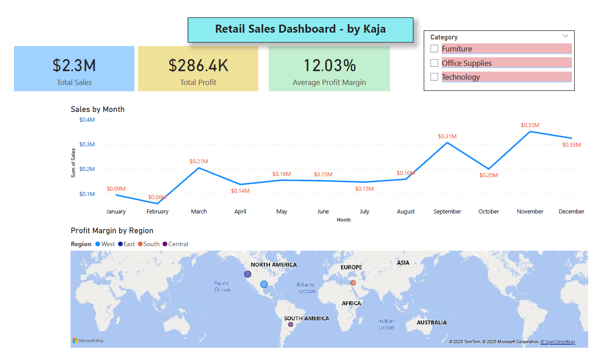

# 🛒 Retail Sales Data Pipeline (ETL + SQL + Power BI)

This project demonstrates an end-to-end data pipeline:
- Cleaned and transformed retail order data using Python
- Loaded into Microsoft SQL Server
- Visualized in Power BI as an interactive dashboard

## 📊 Dashboard Overview

### Key Metrics
- 💰 Total Sales
- 📈 Monthly Trends
- 🌍 Profit by Region (Map)
- 🪟 Interactive Category Filter

## 🧱 Tech Stack
- Python (Pandas)
- Microsoft SQL Server
- Power BI
- GitHub for version control

## 📁 Files
- Retail-Sales-Dashboard.pbix → Power BI file
- Sample-Superstore_clean → Cleaned sample dataset
- Retail-Sales-Dashboard → Visual preview

## 🚀 Future Improvements
- Add a Date dimension table
- Normalize into star schema
- Add Power BI Service publishing

---
📌 Created by **Kaja** — aspiring Data Analyst & Data Engineer in Saudi Arabia 🇸🇦
